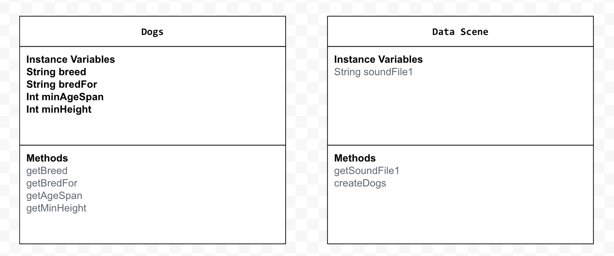

# Unit 4 - Abstract Art Project

## Introduction

Data visualizations are powerful tools to present information and convey patterns and relationships. Sometimes visualizations are charts or graphs, and other times they are more abstract pieces of art. Your goal is to create a visual representation relating at least two categories from your dataset that engages your viewer and encourages them to learn more about your chosen topic.

## Requirements

Use your knowledge of object-oriented programming, one-dimensional (1D) arrays, and algorithms to create your data visualization program:

- **Create at least two 1D arrays** – Create at least two 1D arrays to store the data that will make up your visualization.
- **Implement one or more algorithms** – Implement one or more algorithms that use two-way or multi-selection statements with compound Boolean expressions to analyze the data.
- **Use methods in the Math class** – Use one or more methods in the Math class in your program, such as to perform calculations on the values in your dataset and display the results, choose random values from the dataset, or display images or shapes at random locations.
- **Create a visualization** – Create an image or animation that conveys the story of the data by illustrating the patterns or relationships in the data.
  Note: This may be abstract! Others do not necessarily need to know what the story or pattern is right away, but you do need to be able to explain it to them.
- **Document your code** – Use comments to explain the purpose of the methods and code segments and note any preconditions and postconditions.

## Dataset

Dataset: https://studio.code.org/s/csa4-2024/lessons/8/levels/5

Additional: https://docs.google.com/spreadsheets/d/1lCEpVTYtGUYBD-_efe33KpcCRJv7xLKwD4Q126KwyRI/edit?gid=1638692842#gid=1638692842 

- **Breed** (String) - breed of the dog
- **Bred For** (String) - the purpose the dog is bred for
- **Minimum Age Life Span** (int) - minimum age number of the dogs life span
- **Minimum Height** (int) - minimum height that the dog is 

## UML Diagram

## Description

In my project, I chose to do dogs as my theme. I chose this dataset from code.org, and loved dogs so wanted to pick this specific topic. The way my project works is that when you run it, it shows you a couple of different dogs from the 1d-arrays which are, American pitbull, austrailian shepherd, boxer, german shepherd, and finally the golden retriever. Now as the video plays, each slide has information about that specific dog breed. For example, the golden retriever is bred for retrieving, the minimum life age span is 10, and the minimum height is 22. The overall purpose of this is to recommend and help people find the best dog to have based on their specific preferences. The user could also pause the video at any time to get good information about the dog that they are interested in.